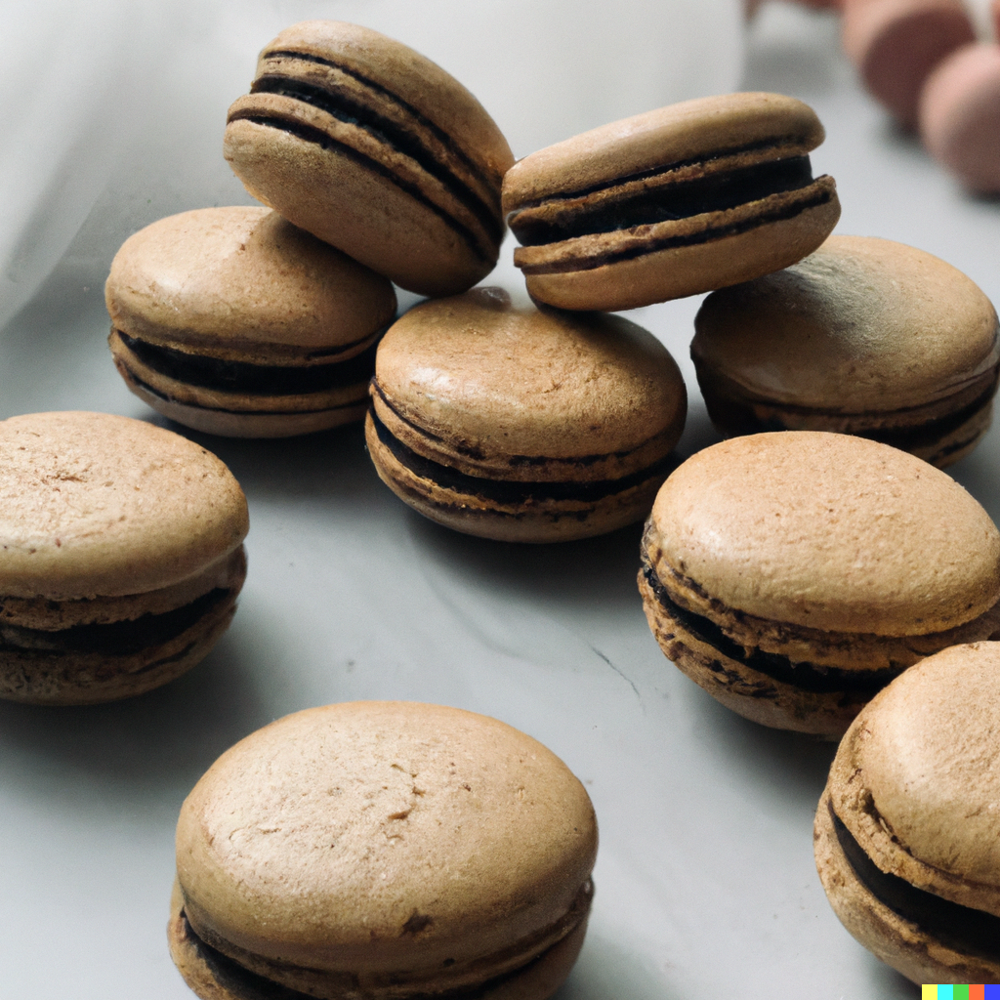

## Here is a recipe for coffee macarons:

## Ingredients:

For the Macaron Shells:

* 200g powdered sugar
* 100g almond flour
* 100g confectioner's sugar
* 3 large egg whites
* 50g granulated sugar
* 1/4 tsp cream of tartar
* 1 tsp instant coffee powder
* Food coloring (optional)

## For the Coffee Buttercream Filling:

* 113g unsalted butter, at room temperature
* 225g powdered sugar
* 2 tbsp heavy cream
* 1 tsp instant coffee powder
* 1 tsp vanilla extract

## Instructions:

1. Preheat your oven to 300°F (150°C) and line two baking sheets with parchment paper.
2. Sift the powdered sugar, almond flour, and confectioner's sugar into a large bowl and set aside.
3. In a separate bowl, beat the egg whites, granulated sugar, and cream of tartar until stiff peaks form.
4. Add the instant coffee powder to the dry ingredients and mix until well combined.
5. Gradually fold the dry ingredients into the egg-white mixture until it is smooth and glossy. You may also add a few drops of food coloring at this stage if desired.
6. Spoon the mixture into a piping bag fitted with a large round tip and pipe 1 1/2 inch rounds onto the prepared baking sheets, leaving about 1 inch of space between each cookie.
7. Bang the baking sheets against a hard surface to release any air bubbles and let the cookies sit at room temperature for 30 minutes to form a skin.
8. Bake the cookies in the preheated oven for 12-15 minutes, or until they are firm to the touch.
9. Remove the cookies from the oven and let them cool completely on the baking sheets.
10. To make the coffee buttercream filling, beat the butter in a large bowl until creamy. Gradually add the powdered sugar and beat until smooth. Add the heavy cream, instant coffee powder, and vanilla extract, and beat until well combined.
11. Spoon the filling into a piping bag fitted with a medium round tip and pipe a small amount onto one half of each cooled cookie.
12. Sandwich the cookies together, gently pressing the halves together to spread the filling evenly.
13. Store the coffee macarons in an airtight container in the refrigerator for 24 hours to allow the flavors to develop. Bring to room temperature before serving.

Enjoy your delicious coffee macarons!