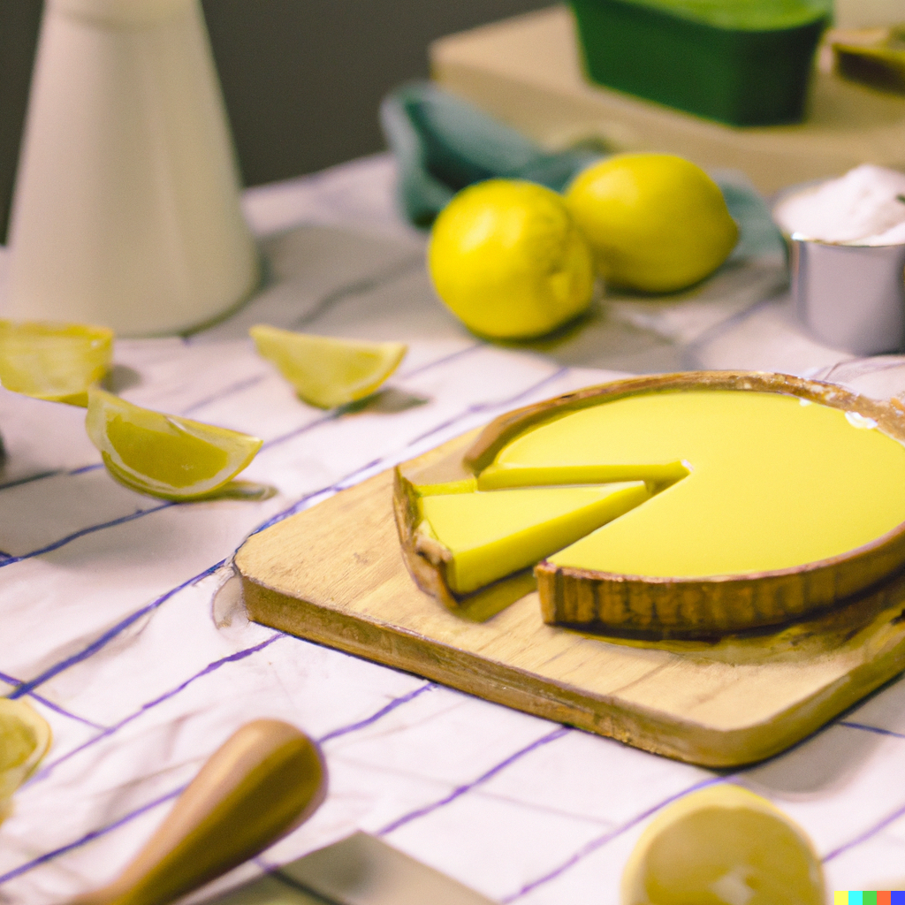

Here's a recipe for lemon tart

Here is a simple recipe for lemon tarts:

## Ingredients:

## For the crust:

* 1 1/2 cups all-purpose flour
* 1/4 cup confectioners' sugar
* 1/4 teaspoon salt
* 1/2 cup unsalted butter, chilled and cubed
* 1 large egg yolk

## For the filling:

* 1 cup granulated sugar
* 1/2 cup fresh lemon juice
* 1 teaspoon lemon zest
* 4 large eggs
* 1/2 cup unsalted butter, cut into small pieces
* Confectioners' sugar for dusting

## Instructions:

1. To make the crust: In a large bowl, whisk together the flour, confectioners' sugar, and salt. Add the butter and use a pastry cutter or your fingertips to incorporate it into the dry ingredients until the mixture resembles coarse sand. Stir in the egg yolk until the dough comes together.
2. Divide the dough into 12 equal portions and press each one into the bottom and up the sides of a muffin cup. Prick the bottom of each crust with a fork and chill in the refrigerator for at least 30 minutes.
3. Preheat the oven to 375°F. Bake the crusts for 12-15 minutes, or until lightly golden. Remove from the oven and let cool.
4. To make the filling: In a medium saucepan, whisk together the sugar, lemon juice, lemon zest, eggs, and butter. Cook over medium heat, whisking constantly, until the mixture thickens, about 10 minutes.
5. Pour the filling into the cooled crusts and return to the oven. Bake for an additional 15-20 minutes, or until the filling is set.
6. Let the tarts cool completely and then sprinkle with confectioners' sugar before serving. Enjoy!