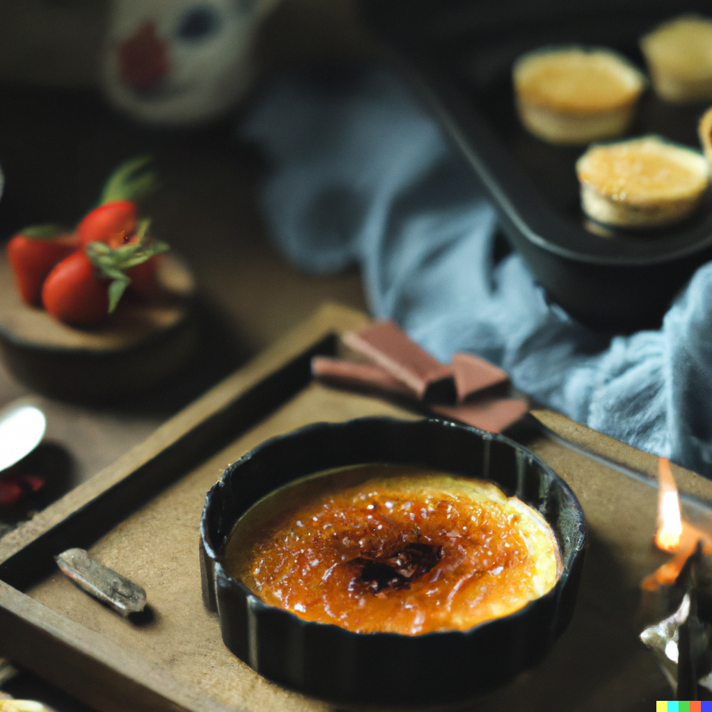

## **Here is a classic recipe for crème brûlée:**

## Ingredients:

* 4 large egg yolks
* 1/2 cup white sugar
* 2 cups heavy cream
* 1 teaspoon pure vanilla extract
* 6 tablespoons white sugar, divided

## Instructions:

1. Preheat oven to 300°F (150°C).
2. In a medium bowl, whisk together egg yolks and 1/2 cup sugar until smooth.
3. In a saucepan, heat cream and vanilla over medium heat until it just begins to boil. Remove from heat.
4. Gradually whisk the hot cream into the egg yolk mixture.
5. Pour mixture through a fine strainer into a clean pitcher, to remove any bits of cooked egg.
6. Divide mixture evenly among six (6-ounce) ramekins.
7. Place ramekins in a baking dish and fill the dish with enough hot water to come halfway up the sides of the ramekins.
8. Bake in preheated oven until just set, approximately 40-45 minutes.
9. Remove ramekins from water bath and refrigerate for at least 2 hours, or until chilled.
10. When ready to serve, sprinkle 2 teaspoons of sugar evenly over each ramekin.
11. Using a kitchen torch, caramelize the sugar until browned, rotating the ramekin as you go to ensure even browning. If you don't have a kitchen torch, you can place the ramekins under the broiler until the sugar caramelizes, but watch them carefully as they can burn easily.
12. Serve immediately. Enjoy!