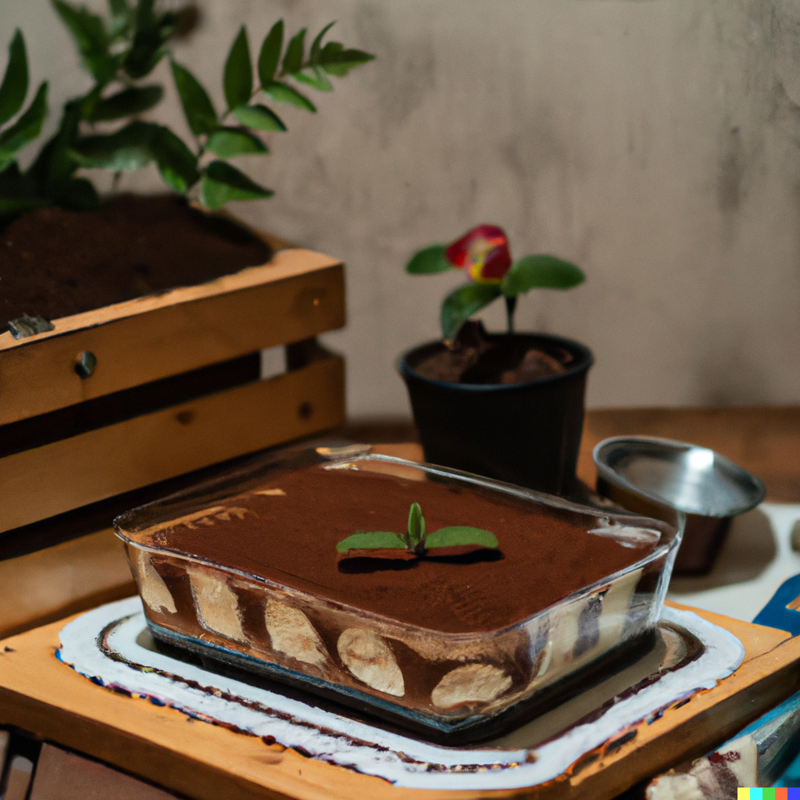

Here's a simple recipe for tiramisu:

## Ingredients:

* 6 egg yolks
* 1/2 cup granulated sugar
* 2/3 cup mascarpone cheese
* 1 1/4 cups heavy cream
* 1/4 cup coffee, cooled
* 2 tablespoons coffee liqueur (such as Kahlua)
* 1 package ladyfingers (about 24)
* Unsweetened cocoa powder, for dusting

## Instructions:

1. In a medium saucepan, whisk together the egg yolks and sugar.
2. Add the coffee to the saucepan and place over medium heat. Cook, stirring constantly, until the mixture thickens and coats the back of a spoon.
3. Remove the pan from heat and stir in the mascarpone cheese until smooth.
4. In a separate bowl, whip the heavy cream until stiff peaks form.
5. Fold the whipped cream into the mascarpone mixture.
6. Dip each ladyfinger into the coffee liqueur and arrange in a single layer in the bottom of a 9x13 inch dish.
7. Spoon half of the mascarpone mixture over the ladyfingers.
8. Repeat with another layer of ladyfingers and the remaining mascarpone mixture.
9. Cover the dish with plastic wrap and refrigerate for at least 2 hours, or overnight.
10. Before serving, dust the top of the tiramisu with cocoa powder.

Enjoy your light and fluffy tiramisu!

